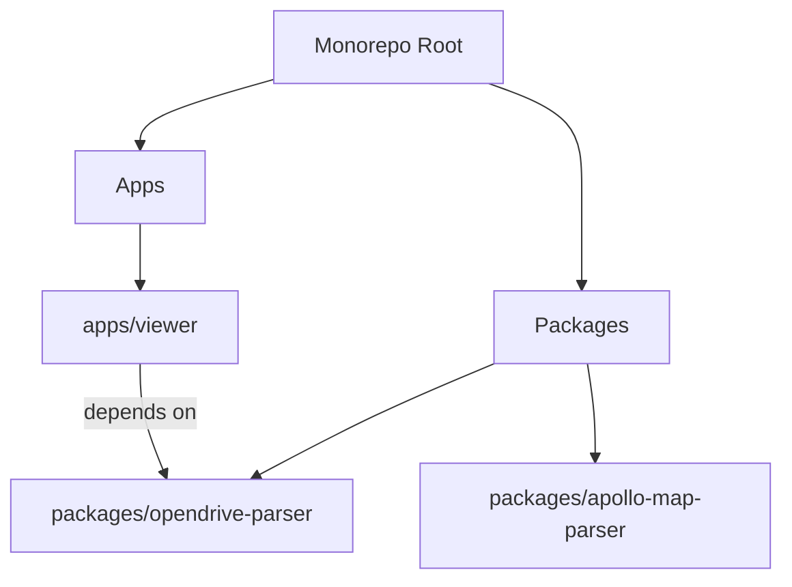

# System Architecture

## Overview

The `hdmap-viewer` project is a monorepo designed for parsing and visualizing High-Definition (HD) Maps, specifically adhering to the OpenDRIVE standard. It separates the core parsing logic from the visualization layer to allow for modularity and potential reuse of the parser in other applications.

## Monorepo Structure

The project uses **pnpm workspaces** and **Turbo** for build management.

### Directories

- **`apps/viewer`**: A web-based application built with Vue 3 and Three.js to render the map data.
- **`packages/opendrive-parser`**: A strictly typed TypeScript library that converts OpenDRIVE XML data into a structured object model with helper methods for geometry processing.
- **`packages/apollo-map-parser`**: A placeholder for future support of Apollo HD Map formats.

## Technology Stack

### Core
- **Language**: TypeScript (strict mode)
- **Runtime**: Node.js (>= 18)
- **Package Manager**: pnpm (>= 9)
- **Build System**: Turbo

### Viewer Application
- **Framework**: Vue 3 (Composition API)
- **Bundler**: Vite
- **Rendering Engine**: Three.js
- **UI Library**: Naive UI
- **State Management**: Pinia

### Parser Library
- **XML Parsing**: `fast-xml-parser`
- **Bundler**: tsup
- **Testing**: (Implied, likely Vitest or Jest based on common practices, though not explicitly seen in the initial file list)

## Data Flow

1.  **Input**: The user loads a `.xodr` file (OpenDRIVE XML) into the Viewer app.
2.  **Parsing**: The Viewer passes the raw XML string to the `opendrive-parser` package.
3.  **Processing**:
    *   The parser converts XML to JSON.
    *   It instantiates the `OpenDrive` class.
    *   It runs a `process()` phase to calculate derived geometry (reference lines, lane boundaries).
4.  **Rendering**:
    *   The Viewer receives the `OpenDrive` object.
    *   It iterates through `roads` and `lanes`.
    *   It generates Three.js meshes (`BufferGeometry`) for lane surfaces and lines (`Line2`) for boundaries.
5.  **Interaction**:
    *   User inputs (mouse movements) are captured.
    *   A Raycaster detects intersections with map elements.
    *   Metadata is displayed in the UI.
